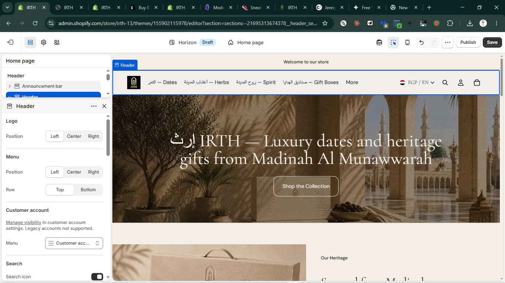
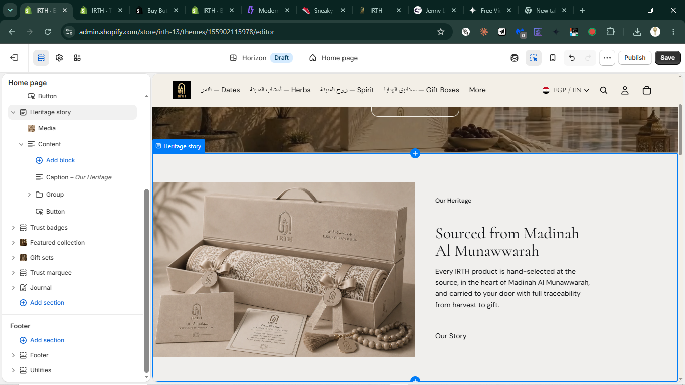

# Design Improvement: IRTH Homepage (Hero + Heritage Story)

## TL;DR
The biggest quick win visible in the actual screenshots: the announcement bar still reads generic Horizon-default copy ("Welcome to our store") above a fully custom, brand-correct hero and heritage section below it — swap that one line for something on-brand and the top-of-page immediately feels finished rather than half-migrated.

## Current State

*Header + hero: "إرث IRTH — Luxury dates and heritage gifts from Madinah Al Munawwarah" over an archway/dates-bowl photo, single "Shop the Collection" CTA, left-aligned text block. [Live capture]*


*Heritage story section: gift-box product photography left, "Our Heritage" eyebrow / "Sourced from Madinah Al Munawwarah" heading / body copy / "Our Story" text link right. [Live capture]*

## Improvement Ideas

### 1. Replace the generic announcement bar copy ⭐ (highest impact, lowest effort)
"Welcome to our store" is Horizon's stock placeholder — visible in the live capture, top of every page. It's the one piece of the homepage that doesn't read as IRTH. Every trust-badge/marquee line already written for the theme ("Halal Certified · 100% Traceable · Sourced from Madinah Al Munawwarah") is a drop-in replacement, or rotate seasonal messaging (Ramadan, free GCC shipping).

**Why this works:** heritage-gift leaders (Bateel, Fortnum & Mason) use every visible surface for brand voice — an empty/generic top bar is the fastest tell that a section wasn't customized. This is a one-line settings change, not a rebuild.

**Sketch:**
```
┌──────────────────────────────────────────┐
│ HALAL CERTIFIED · FREE SHIPPING GCC       │ ← was "Welcome to our store"
├──────────────────────────────────────────┤
│  [logo]   Dates  Herbs  Spirit  Gifts     │
├──────────────────────────────────────────┤
│         إرث IRTH — Luxury dates...        │
```

### 2. Upgrade "Our Story" from a text link to a real secondary action
In the heritage-story section, "Our Story" currently sits as a bare underlined link below the body copy — lowest visual weight on the page. The hero CTA above it is a solid pill button; the heritage section's CTA should echo that button language (even as a ghost/outline variant) so the two sections read as one coherent flow rather than the second section trailing off.

**Why this works:** matches the earlier liquid-glass/modern-design research (Aesop pattern) — restrained but *present* secondary actions, not link-only afterthoughts. Horizon's `media-with-content` block already has a `button` block type with a `style_class` setting (`button-unstyled` currently used) — switching to the outline/ghost button class is a one-setting change, no new markup.

**Sketch:**
```
Our Heritage
Sourced from Madinah Al Munawwarah

Every IRTH product is hand-selected...

┌─────────────┐
│  Our Story →│   ← was a bare text link
└─────────────┘
```

### 3. Apply the researched liquid-glass treatment to the header, scoped to scroll state
Ties directly to the prior liquid-glass research (`irth-liquid-glass-modern-redesign-2026-07-01`): the header in the live capture is a flat black bar. Making it translucent/blurred *only after the user scrolls past the hero* (not on initial load, where it sits over the photo) gives the "depth on secondary surfaces" effect the 2026 sources all converge on, without touching the calm, opaque product-page chrome.

**Why this works:** avoids the #1 flagged anti-pattern (global glassmorphism) while still landing the trend in the one place — a persistent nav — where every research source says it belongs.

**Sketch:**
```
Scroll = 0px:        Scroll > 0px:
┌────────────┐       ┌░░░░░░░░░░░░┐  ← blurred/translucent
│ solid black │       │░ logo  nav░│
│ over photo  │       ├────────────┤
└────────────┘        [ page content ]
```

## What's Working
- **Single-CTA hero discipline** — "Shop the Collection" is the only call to action on the hero; no competing "Learn more" link diluting it. Matches every luxury-ecommerce source in the research (max one primary CTA).
- **Left-aligned, asymmetric hero composition** — text block sits left over a photo with clear negative space, not centered — already the "editorial, not centered-generic" pattern the research flags as best practice.
- **Heritage section restraint** — generous whitespace, one photo, short copy block. Not overloaded with stats or badges crammed into the same section (trust badges live in their own dedicated section below, which is the right call).
- **Bilingual nav labels** (`التمر — Dates`, `أعشاب المدينة — Herbs`) already visible and legible in the header — the bilingual identity is present without cluttering the layout.

## All References
- `references/current-hero.png` — live capture, IRTH homepage header + hero, this session
- `references/current.png` — live capture, IRTH homepage heritage story section, this session
- Research synthesis carried over from `.lazyweb/design-research/irth-liquid-glass-modern-redesign-2026-07-01/report.md` (Bateel, Fortnum & Mason, To'ak Chocolate, Aesop — see that report's Sources section for full URL list)

**Limitation:** Lazyweb MCP not installed this session; no image-similarity search was run against the current screenshots. Recommendations are grounded in the live captures plus the prior web-research pass, not a Lazyweb visual-match set.
